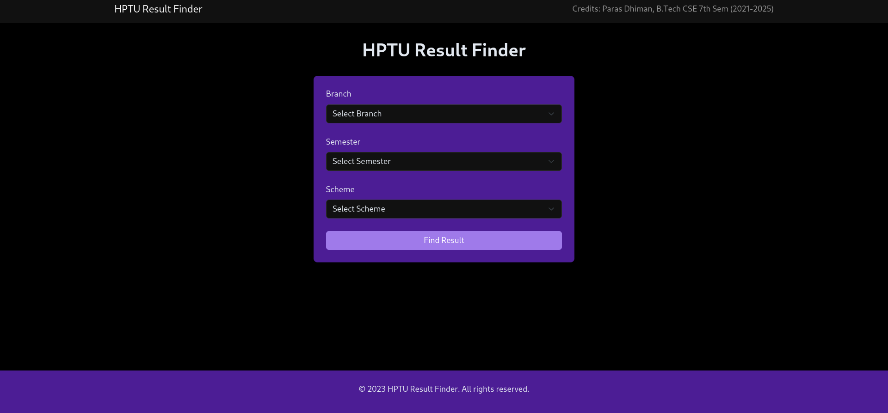
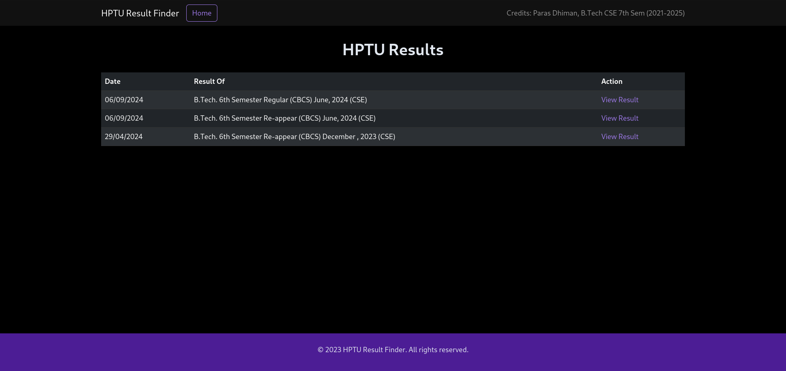

# HPTU Result Finder

This project is a web application that allows B.Tech students of Himachal Pradesh Technical University (HPTU) to easily access and filter their results. The application scrapes data from [HPTU Results](https://himachal-pradesh.indiaresults.com/himtu/default.aspx) and displays it in a user-friendly interface. Users can filter results by semester, branch, and scheme to find relevant information quickly.

> **Note**: The website only supports B.Tech students. Results for other trades are not available.

## Features

- **Beautiful UI**: Styled using Tailwind CSS and Bootstrap for a responsive and modern design.
- **Custom Filters**: Filter results based on semester, branch, and scheme.
- **Automatic Data Fetching**: Scrapes results from the HPTU website.
- **JSON API Integration**: Backend API that provides filtered data for the front end.

## Screenshots

Here are some screenshots of the application in action:

### Home Page

### Filtered Results

